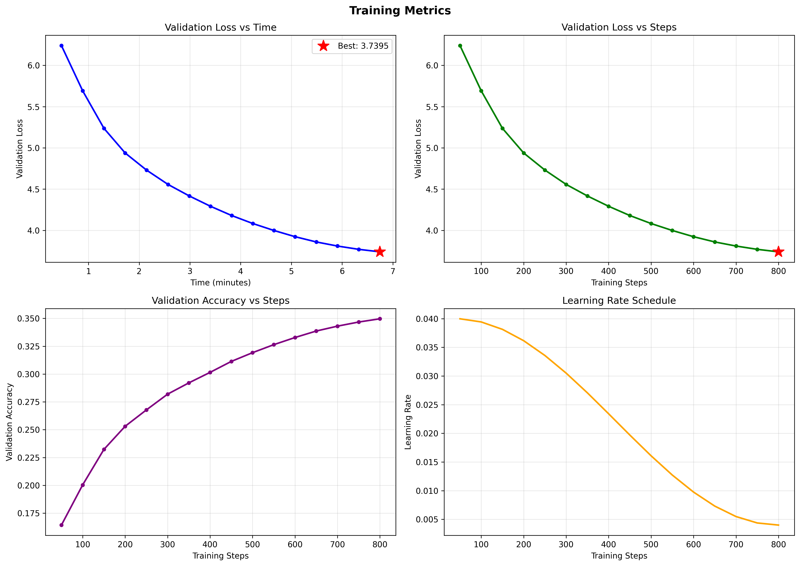

# 5-Dollar LLM (Blueberry 151M)

> Training the best possible LLM from scratch for $5.

- 151M paramters dense LLM.

**Open Superintelligence Lab** - Open research for everyone. We publish all of our research for the sake of accelerating science. Learn real AI research from a real research lab.

## 📺 YouTube Video

[](https://youtu.be/dayc3y34XXs)

🎥 **[Watch our introduction video](https://youtu.be/dayc3y34XXs)** to learn more about the project!

## 🗺️ Roadmap

**Our goals:**
1. **Top 150** in LMArena (GPT-4o-mini level) by April 2026
2. **Top 50** by Dec 2026
3. **Top 10** by April 2027
4. We could aim for **Top 1** by 2028, TBD

**Likely architecture for our first LLM (Top 150, April 2026):**
- 8 Billion Parameters
- 15 Trillion Tokens

This requires 300,000 H100 hours or equivalent.

We will partner with one or multiple partners for this compute while keeping all research / engineering / code FULLY open source (and making daily videos on everything we do), for the sake of open science that benefits everyone.

**Potential partners include:**
Hugging Face, NVIDIA, Microsoft, Google, Amazon, Meta, IBM, Oracle, Alibaba, Tencent, Huawei, Baidu, CoreWeave, Lambda Labs, Hyperbolic, Stability AI, OpenAI, Anthropic, xAI, Cohere, Mistral AI, Graphcore, Tenstorrent, Intel, AMD, Dell Technologies, ai2, a16z, Sequoia Capital, and more.

As a community, we will find ways to get the compute.

Currently LLMs are the most useful AI models, so it's a clear way for us to do useful research. As we gain more experience, we will expand towards more speculative research that could lead to better AI models.

**If you or someone you know has extensive research experience and can offer advisory or leadership support, please contact me.**

---

## 🚀 Getting Started & Contributing

We welcome all contributions! Follow this workflow to get started:

### 1. **Pick a task**
Check the [Tasks](https://github.com/Open-Superintelligence-Lab/5-dollar-llm/issues) and carefully read and understand the task you want to work on. Leave a comment or send a Discord message when you begin working on it. If you want to do something that is not listed, please tell us on Discord to ensure you do it in a way that aligns with our goal.

### 2. **Set up your environment**

1. **Fork this repository** - Click the "Fork" button at the top right to create your own copy.
2. **Clone your fork**:
   ```bash
   git clone FORK_URL_HERE
   cd 5-dollar-llm
   ```
   *(You may also clone it with your IDE)*
   
   > **Note:** If you have already forked/cloned, please ensure you sync your fork with this repo & pull the latest changes to your local before starting - we make frequent changes.

3. **Install dependencies**:
   ```bash
   pip install -r requirements.txt
   ```

### 3. **Implement your changes**
Write your code following the setup instructions above and our coding standards.

## ⚡ Quick Start

Once installed, you can train a model using our default configurations.

### Train on Custom Hardware (Recommend 24GB+ VRAM)
To train the main MoE model (configured for a single 24GB GPU like an RTX 3090/4090):

```bash
python train_llm.py
```

### Debugging (Any Hardware)
To quickly check if your code runs without errors on any hardware (including CPU/GPU), use the debug script:

```bash
python debug_llm.py
```
*Runs a `DebugMoEConfig` with a tiny model for 100 steps.*

## 📊 Baselines

We maintain baseline performance metrics to track improvements. All experiments should aim to surpass these benchmarks.

### 24GB GPU Baseline (GPU24GBMoEModelConfig)
*Hardware: Single Nvidia RTX 4090 (24GB)*

> You may train on other hardware.

| Metric | Value |
| :--- | :--- |
| **Validation Loss** | 3.6684 |
| **Validation Accuracy** | 35.64% |
| **Perplexity** | 39.19 |



*Full baseline results are stored in `baselines/gpu_24gb/`.*

### Statistical Significance Analysis (450 Steps)
To establish a reliable baseline for comparisons and measure system noise, we ran the `GPU24GBMoEModelConfig` for 450 steps across 4 independent runs using the same random seed (42).

| Run | Seed | Val Loss | Val Accuracy | Val Perplexity |
| :--- | :--- | :--- | :--- | :--- |
| Run 1 | 42 | 4.1098 | 31.89% | 60.94 |
| Run 2 | 42 | 4.1009 | 32.00% | 60.40 |
| Run 3 | 42 | 4.1082 | 31.91% | 60.84 |
| Run 4 | 42 | 4.1131 | 31.89% | 61.13 |

**Aggregated Results (Mean ± Std Dev):**
*   **Validation Loss**: 4.1080 ± 0.0045
*   **Validation Accuracy**: 31.92% ± 0.05%
*   **Validation Perplexity**: 60.83 ± 0.27

*Future experiments running for 450 steps should be compared against these statistically derived bounds to determine significance.*

## 🧪 Running Experiments

To run a new experiment without overwriting the baseline, simply provide a unique experiment name:

```bash
python train_llm.py --experiment_name my_new_experiment
```

Results (checkpoints and logs) will be saved to `checkpoints/my_new_experiment/` for easy comparison.

> **Performance Test (optional):** We will run the experiments anyways, but you may also run it yourself. Make sure to specify a new name so you don't overwrite the baseline.

### 4. **Verification & Testing**
   - **Debug Mode:** Run `python debug_llm.py` to quickly verify your code runs without errors.
   - **Performance Test (optional):** Run your experiment with a unique name to test performance.

### 5. **Submission**
Once finished, create a Pull Request into the `development` branch. Please notify us on [Discord](https://discord.gg/6AbXGpKTwN).

> Please read `CONTRIBUTING.md` for detailed guidelines.
